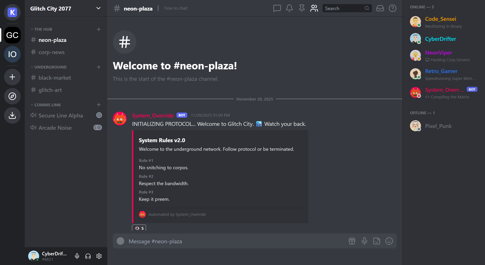

# KiezzCord 🚀

**KiezzCord** is a feature-rich, modern chat application clone inspired by Discord, built with **React**, **TypeScript**, and **Tailwind CSS**. It features a Cyberpunk/Sci-Fi theme and a host of interactive features designed for users to have fun.



## ✨ Features

KiezzCord comes packed with 10+ immersive features:

*   **🎨 Dynamic Themes**: Switch between Light, Dark, and Midnight (AMOLED) modes, or choose your favorite Accent Color (Neon Cyan, Pink, etc.).
*   **🗣️ Text-to-Speech (TTS)**: Read messages aloud with a single click.
*   **🎉 Interactive Effects**: Type "congrats", "wow", or "yay" for a confetti explosion!
*   **🔊 Soundboard**: Play fun sound effects (Airhorn, Vine Boom, Quack) directly in chat.
*   **🖼️ Drag-and-Drop Uploads**: Seamlessly drag images into the chat to share them.
*   **🔍 Image Lightbox**: View shared images in a beautiful full-screen gallery mode.
*   **🟢 Rich Presence**: See what users are doing (Playing games, Coding, Listening to music) with automatic status icons.
*   **🗳️ Interactive Polls**: Create polls with `/poll "Question" "Option1" "Option2"` and watch bots vote!
*   **🤖 Embed Messages**: Rich system messages with colored borders and fields.
*   **📌 Pinned Messages**: Pin important messages and view them in a dedicated slide-out panel.
*   **💎 User Profiles**: Click any user to view their detailed profile card with banners, badges, and roles.

## 🛠️ Tech Stack

*   **Frontend**: React 18, TypeScript, Vite
*   **Styling**: Tailwind CSS
*   **Icons**: Lucide React
*   **State Management**: React Hooks (Context-like pattern)
*   **Utilities**: `canvas-confetti`, `emoji-picker-react`

## 🚀 Getting Started

1.  **Clone the repository**
    ```bash
    git clone https://github.com/yourusername/kiezzcord.git
    cd kiezzcord
    ```

2.  **Install dependencies**
    ```bash
    npm install
    ```

3.  **Run the development server**
    ```bash
    npm run dev
    ```

4.  **Build for production**
    ```bash
    npm run build
    ```

## 🎮 Commands

Try these slash commands in the chat:

*   `/flip` - Flip a coin (Heads/Tails)
*   `/roll` - Roll a 100-sided die (or `/roll 20`)
*   `/poll "Question" "Yes" "No"` - Start a poll

## 🤝 Contributing

Feel free to fork this project and submit PRs for new features!

## 📜 License

MIT
